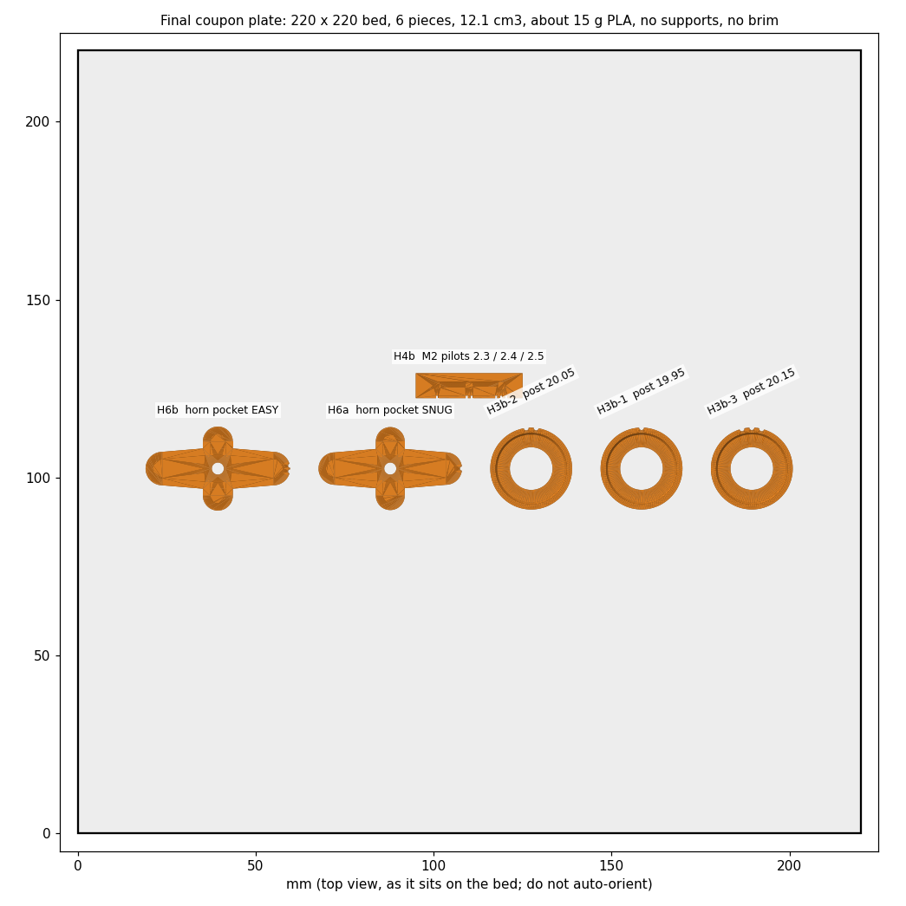
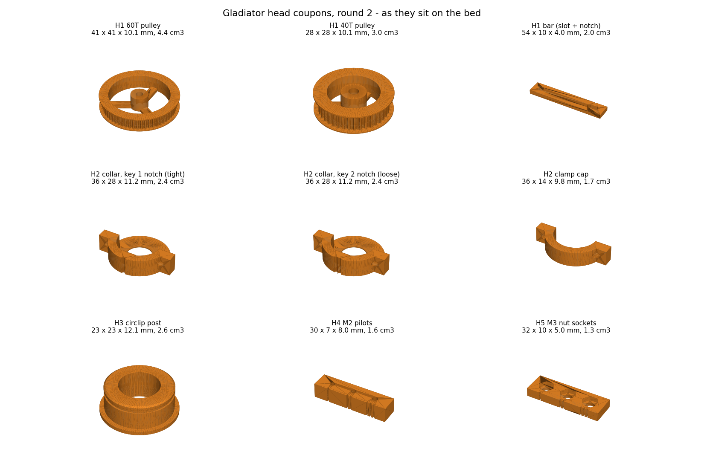
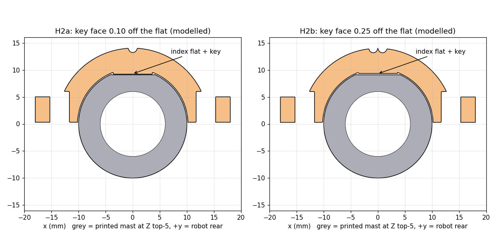
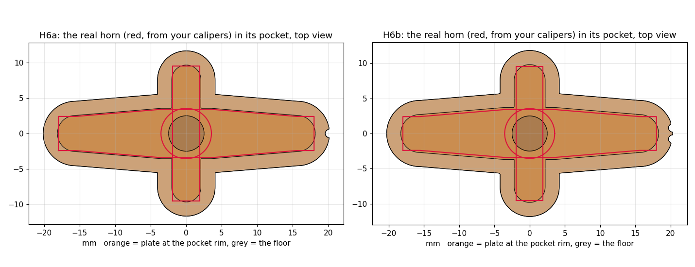

# Gladiator head coupons, round 2 (2026-09-30, updated 2026-10-01)

Small coupons, each answering **one** question the head can't be finished without.

## Where it stands (2026-10-01)

The first nine pieces (plate `ALL-9-pieces`) are printed and tested. What they decided:

| Coupon | Question | Result | Used in v0.4 |
| --- | --- | --- | --- |
| **H1** belt | what pulley spacing for the 180 mm belt? | tightest about **midway up the slot**, near 39.75 (eyeballed). Theory is 39.49, and 39.88 if the pulleys print 0.25 small. The first reading of 38.4 was a slack belt plus measurement error | tension slot about 2.5 mm long, centred near **39.7** |
| **H2** collar | which key fits the mast flat? | the 1-notch key (0.10 from the flat) grips tighter, as the model says | the **1-notch key, 0.10** |
| **H3** post | does a 6804 slide on a 20.20 post? | **No. Jammed solid** | replaced by H3b |
| **H4** M2 pilots | which hole holds an M2? | the biggest (2.2) clearly, "maybe slightly bigger" | H4b tests 2.3 / 2.4 / 2.5 |
| **H5** nut pockets | which hex takes an M3 nut? | the 6.0 across-flats pocket, perfectly | **6.0 AF** |
| **H3b** posts | which post does a 6804 slide onto? | **the 2-notch post (20.05) wins** (Jim, 2026-10-01) | spindle post **20.05** |
| **H4b** M2 pilots | 2.3 / 2.4 / 2.5? | Jim: "right in the middle between 1 and 2" | M2 pilot **2.35** |
| **H6** horn pocket | snug or easy? | **the 1-notch (snug, 0.15)** | pocket clearance **0.15** |

**The coupon rounds are done.** Not reported from the final plate: whether the circlip seated on the
2-notch post, how far the horn arms stood above the H6 rim, and whether the horn screw head sat on the
3.4 hole.

One loose end: Jim measured the 60T pulley's flange at **40.65** against 40.689 modelled, so a
large round part printed only 0.04 small, not the 0.25 the calibration predicts. Smaller round
parts may lose more. That is why H3b brackets the post widely.

## The final plate

`Gladiator_HeadR2_FINAL-COUPON-PLATE_6-pieces.3mf`. Six pieces, 12.1 cm3, about 15 g of PLA. These
are the only things still unproven that the head's real parts depend on.

| Piece | Question |
| --- | --- |
| **H3b-1, -2, -3** bearing posts at 19.95 / 20.05 / 20.15 | which post lets a 6804 slide on by hand, then hold a circlip? |
| **H4b** M2 pilots 2.3 / 2.4 / 2.5 | which hole holds an M2? |
| **H6a, H6b** horn pockets, snug and easy | does the real cross horn drop in, and does the horn screw's head hold the plate? |

Order: do **H3b-1 first** and work upward. Never force a bearing. If it does not go on by hand,
stop and pull it off by hand, then try the next size up. Two bearings jammed already.

The head's real parts wait on the v0.4 rebuild, which happens in parallel with this plate.

**Context.** Head v0.3 (`cad/head/v03-belt/`) is on hold. Its pulley ratio is reversed (40T
driving 60T turns the head *less* than the servo), its belt centre distance is 0.26 mm off, and
it predates the printer calibration. v0.4 will be rebuilt around the real v2 mast (top Z 130) and
around what these coupons show. **Do not print anything from `v03-belt/stl/`.**

The 60T horn-slot coupon in `cad/head/drive-coupons-20260922/` is left out on purpose. Its
belt channel is 6.0, which rubs a 6 mm belt, and its top flange is an unsupported overhang.
Round 3 replaces it once the horn is measured.

**Assumed still true:** the plate F results recorded 2026-09-21/22 in `measurements/mast-head.md`
are real prints. Those were bearing seat 32.35 / post 20.20 (#2), the two-notch belt groove
(r 0.65), and the GH44 register fitting. If any of them was never actually printed, those coupons
go back into this batch.

## Printing

- **Current:** `Gladiator_HeadR2_FINAL-COUPON-PLATE_6-pieces.3mf`. Or print the
  `stl/Gladiator_HeadR2_*.stl` pieces singly.
- **Already printed:** `Gladiator_HeadR2_CouponPlate_ALL-9-pieces.3mf`. An earlier version of the
  generator wrote it, and the STLs are unchanged.
- The same files are in `~/3D-Printer/Incoming/Gladiator/`.
- The first nine were 21.4 cm3, about 27 g of PLA. The final plate is 12.1 cm3, about 15 g.
- PLA, 0.2 mm layers, normal profile.
- **No supports.** Every piece is on its correct face; **do not auto-orient.**
- No brim needed. The smallest bed contact is the clamp cap at 183 mm2; the belt arcs that
  needed a brim had about 100.
- Every hole that starts on the bed has the usual 0.5 mm entrance relief.

## H1 — belt centre distance

**Question:** at what centre distance does the real 180 mm belt sit snug on *printed* 60T and 40T
pulleys, and does it run round cleanly?

Pieces: `H1a` 60T pulley, `H1b` 40T pulley, `H1c` slotted bar. **You need:** two M3 bolts
16–20 long, two M3 nuts, and a belt.

1. Push a bolt up through the round hole from underneath, put a nut on top and tighten it.
   Drop the 60T pulley onto it, flange down.
2. Push the second bolt up through the slot and put a nut on top, finger tight. Drop the 40T
   pulley onto it.
3. Loop the belt round both. Slide the 40T bolt outward until the belt is **snug**: no slack on
   either run, but it still turns easily. Tighten that nut.
4. Turn the 60T by hand a few full turns each way. Check that the belt teeth seat, the belt
   doesn't climb a flange, and nothing clicks or skips.
5. Put calipers across the two bolt shanks: **outside to outside (O)** and **inside to inside (I)**.

**Report:** I and O, whether it ran cleanly, and anything odd.
The centre distance is (I+O)/2, so no bolt diameter needs guessing.

The V notch in the bar's side marks the theoretical 39.49. Expect the answer to land a little
further out, around 39.9, because round features on this printer print about 0.25 small and
that shrinks both pulleys.

Why these tooth counts: the 60T goes on the servo and the 40T on the head, so the head turns
1.5x the servo. Your 200 degrees of head travel then needs 133 degrees of servo, inside the
measured 160. The teeth use the two-notch groove that passed on 09-22. The channel between the
flanges is 7.0 mm; v0.3 had 6.0, which would rub a 6 mm belt. The top flange is a 45 degree
cone so it prints without support.

**Unblocks:** both pulleys, where the servo sits on the neck, and the range of a tension slot.
v0.4 will have a slot, so the belt no longer depends on hitting one fixed number.

## H2 — neck collar on the real mast

**Question:** does the neck collar slide onto the top of the printed v2 mast, sit on the top rim,
key into the index flat, and clamp solid? Which key is the tightest that still slides on?

Pieces: `H2a` rear half with the TIGHT key (1 notch, key face 0.10 off the flat), `H2b` rear half
with the LOOSE key (2 notches, 0.25 off), and `H2c` the clamp cap. **You need:** two M3 bolts
about 16 long and two M3 nuts. Test on the robot with the mast fitted.

1. Start with **H2b (loose)**. Seat disc up, hook it over the mast top from behind with the key
   in the flat (the flat faces the rear of the robot), and push down until the disc sits on the
   top of the mast.
2. Slide the cap in from the front, under the disc. Bolts through the lugs, nuts on, tighten
   firmly.
3. With the bolts **loose**, how much can it turn: none, a little, or a lot? With the bolts
   **tight**, does it hold solid when you twist it?
4. Repeat with **H2a (tight)**.

**Report:** does each one slide on by hand, does the disc sit flat on the mast top, and the
loose/tight twist result. Also any cracking at the lugs.

Bore 20.4, the same as the deck and mast-base sockets the mast already slides into. The key is
7.2 wide in the 8.0 flat. The clamp gap is 0.6. This is a 10 mm tall slice of the real 16 mm
collar; the fit is what's being tested, not strength.

**Unblocks:** the neck's collar, key and clamp.

## H3 — circlip post (result: jammed. Superseded by H3b below)

**Result, 2026-10-01 (Jim):** the 20.20 post was too tight. The bearing would not go fully on and
two pairs of pliers could not pull it off. The same 20.20 had fitted as plate F post #2, so the size
is not repeatable run to run. The circlip was not tested.

## H3b — bearing posts, three smaller sizes (the replacement)

Three copies of the H3 post at **19.95 / 20.05 / 20.15** (1, 2, 3 notches on the shoulder rim).

| Modelled | If it loses 0.25 | If it loses 0.10 | If it loses 0.04 |
| ---: | ---: | ---: | ---: |
| 19.95 | 19.70 (loose) | 19.85 | 19.91 |
| 20.05 | 19.80 | **19.95** | 20.01 |
| 20.15 | 19.90 | 20.05 | 20.11 (tight) |

The 60T flange lost only 0.04, and the earlier calibration says 0.25, so I don't know which this post
will see. The three sizes cover the whole range.

1. Start with **1 notch**. Slide the bearing down by hand onto the shoulder.
2. **Stop at the first post that does not go on by hand.** Never force it, and take the bearing off
   by hand.
3. On the best post, fit the circlip into the groove.

**Report:** which posts slid on by hand, which is the best, whether the bearing rattles, and
whether the circlip seated. **You need:** one bearing, one circlip, circlip pliers.

---

*The original H3 notes follow, for the record.*

**Question:** does a 6804 slide down the printed post onto the shoulder, and does a 20 mm
external circlip snap into the printed groove above it and hold it without rattle?

**You need:** one bearing, one circlip, and circlip pliers.

1. Slide the bearing down the post onto the shoulder. It should go on by hand; this is the
   plate F post #2 size, 20.20.
2. Fit the circlip into the groove above it.

**Report:** did the bearing slide on, and did the circlip go fully into the groove? Does the
bearing rattle up and down, and can you pull it off by hand?

The groove is modelled at 19.25 so it prints near the standard 19.0. It is 1.4 wide for a
1.2 ring and starts 0.1 above the bearing. The post has the real spindle's 12 mm cable bore, so
the wall is as stiff (or not) as the real one.

**Unblocks:** the spindle and bearing stack on the neck.

## H4 — M2 pilots

**Question:** which pilot lets an M2 machine screw form a thread and hold firmly without
splitting? Try one of the SG90's own ear screws in the same three.

There are three blind holes, 7 deep, modelled 1.8, 2.0 and 2.2 (they print about 1.55, 1.75 and
1.95). The notches on the long side count 1 to 3, with 1 the smallest.

**Report:** the best hole for the M2 screw, and the best for the SG90 ear screw.

**Result, 2026-10-01 (Jim):** the biggest hole (3 notches, 2.2 modelled) was clearly the best for
an M2, "maybe slightly bigger". A second bracket, **H4b**, covers 2.3 / 2.4 / 2.5
(`Gladiator_HeadR2_H4b_M2Pilots-BIGGER_flat.stl`). Same test, same notch marking.

**Unblocks:** the pan rotor / retainer / pedestal screws, the servo ear screws, and sensor
screws. v0.3 designed those screws as M2 self-tappers, which aren't in the build.

## H5 — M3 nut sockets

**Question:** which hex socket takes an M3 nut pressed in by thumb, and keeps it there?

There are three sockets, 5.8, 6.0 and 6.2 across flats, 2.6 deep, each with a 3.6 through hole.
Notches 1 to 3, with 1 the smallest. The GH44 receiver's 5.7 sockets took no nut on 09-22.

**Report:** which one.

**Unblocks:** the GH44 receiver's nut sockets and any captive nuts in v0.4.

## H6 — horn pocket (added 2026-10-01, after the first nine were printed)

Added after your horn calipers came in; it is **not** on the 9-piece plate.
Files: `Gladiator_HeadR2_H6a_HornPocket_1notch-SNUG_pocket-up.stl` and
`..._H6b_HornPocket_2notch-EASY_pocket-up.stl`. Together they are 2.7 cm3, flat, no supports.
`Gladiator_HeadR2_CouponPlate_ALL-11-pieces.3mf` is all eleven pieces; the 9-piece plate is the
one already printed.

**Question:** does the real cross horn drop into a printed pocket and sit flat, with no rotational
play? Which clearance is right?

**Why a plate.** The long arms span 36 mm, but the 60T pulley's tooth root is 36.19 across, so a
horn-shaped pocket can't sit inside the toothed part. In v0.4 the pocket will be in a wider plate
on the drive pulley's servo side. This coupon is that plate alone.

1. Drop the horn into the pocket **boss-DOWN**, so the raised hub goes into the round recess in
   the floor and the flat arm face is up. (An earlier version of this README said boss-up. That
   was wrong. The recess is in the floor.) The long arms go along the long axis.
2. **Report which key fits:** 1 notch (0.15 per side) or 2 notches (0.30 per side), whether it
   drops in by hand, and whether it rocks.
3. **How far do the arms stand above the rim, or do they sit below it?** That gives the arm
   thickness, which I don't have. The pocket is 1.2 deep, an assumption.
4. **Does the boss clear its round recess?** It should stand into it by about 1.
5. **The centre hole is 3.4 (changed 2026-10-01 from 5.0, which the screw head would have fallen
   through).** Take the screw that normally holds the horn onto the servo. Does its **shank pass**
   the hole, and does its **head sit on the plate** instead of dropping through? Does a small
   driver reach the head through the hole?

**How the plate is held (the plan this tests):** the horn screw goes down through the plate's
centre hole, through the horn hub and into the servo shaft. Its head presses the plate onto the
horn, so the one screw holds both on. The pocket's shape carries the turning force. It has **no
other screw holes**, so it needs no hole positions from the horn's arms. If the screw's head is
smaller than 3.4, tell me and I'll shrink the hole. The head is about 4 mm in the photo, but that
was read off the picture, not measured.

---

## Measurements

### Already recorded — do not ask again

Jim has already taken these. They are spread over two files, so check both before asking.

| What | Value | Where |
| --- | --- | --- |
| SG90 ear-hole pitch | about 27.2 | `measurements/mast-head.md` |
| SG90 ear thickness / hole dia / tip-to-tip span | 2.5 / 2.5 / 32.5 | mast-head.md |
| **SG90 heights, from the flat bottom** (2026-10-01) | spline top **32**; case boss top **28.5**; ear underside **17.5** (the old 17 was within 0.5) | mast-head.md |
| **SG90 body length, ears not counted** (2026-10-01) | **22.7** | mast-head.md |
| ~~SG90 ear underside to installed horn underside~~ | ~~about 13.2~~. **Do not use.** A horn seated on the boss sits about 11.0 above the ear underside | mast-head.md |
| ~~SG90 shaft centre to the near short end~~ | ~~8.3~~. **Superseded:** about 5.9 (+-0.6), see mast-head.md | mast-head.md |
| SG90 usable sweep | 160 degrees | mast-head.md |
| SG90 count | about six | mast-head.md |
| **Cross horn** (2026-10-01) | long tip to tip 36; short tip to tip 19; long arm 6.8 at the hub, 4.8 at the tip; short arm 3.8; hub dia 7.1; boss about 1 proud | mast-head.md |
| Cross horn holes | five per long arm, two per short arm (photo); pitch not measured | mast-head.md |
| **Screen visible area position** (2026-10-01) | 6.2 from the pin-hole edge, 1.5 from the top | components.md |
| **SG90 spline** (2026-10-01) | 4 and about 15 from the body ends; M2 does not thread into it | mast-head.md |
| Belts / bearings / circlips / pulleys | 5 x GT2 6 mm 180 closed; yes; yes; **no pulleys** | mast-head.md |
| Screws | mostly M2 / M3 screws, nuts and bolts | mast-head.md |
| ST7789 board | 62.5 x 29, 3.2 thick | mast-head.md |
| **ST7789 hole pattern** | **26.00 x 58.25 centres, confirmed by the plate F gauge** | `measurements/components.md`, Display |
| **ST7789 visible area** | **51.2 x 25.6** | components.md, Display |

`mast-head.md` still carries the raw 09-20 screen readings flagged "do not build from these".
The Display section of `components.md` supersedes them.

### Still missing

Two-reading rule for any pair of holes: jaws inside both (I), then outside both (O).

1. **Cross horn: arm thickness and total height** (one number each, the horn off the servo).
   H6 will give the thickness indirectly if you'd rather skip it.
2. **Which sensors go on the first head** (ToF, radar, screen, camera)? That sets how many wires
   go through the 12 mm bore.
3. **Horn screw head diameter**, one caliper reading. It decides whether H6's 3.4 centre hole is
   right. No longer needed: the two-screws-as-pins readings on the arm holes, since the plan
   holds the plate with the horn screw and not the arm holes.

Answered 2026-10-01 and no longer open: the screen window position (6.2 / 1.5), the cross horn's
widths and hub, M2 into the spline (no), and the SG90 heights and body length. The servo needs
no further readings for now. The shaft position is good to about +-0.6, so v0.4 will give the
servo carriage a slot rather than a fixed point. The screen's pin header isn't fitted yet. The
coupons test the rest: the mast fit (H2), the circlip and bearing width (H3), and the nut and
screw fits (H4, H5). If the circlip won't go into H3, measure its thickness then.

## Files

| File | What |
| --- | --- |
| `stl/Gladiator_HeadR2_*.stl` | one per piece, 0.01 mm mesh, already in print orientation |
| `Gladiator_HeadR2_CouponPlate_ALL-9-pieces.3mf` | the first nine. **Already printed** |
| `Gladiator_HeadR2_FINAL-COUPON-PLATE_6-pieces.3mf` | **the current plate:** H3b x3, H4b, H6a, H6b |
| `Gladiator_HeadCoupons_R2.FCStd` / `.step` | the solids, in print orientation |
| `validation.json` | per-piece checks and the H1 numbers |
| `../../../scripts/build_head_coupons_r2.py` | rebuilds all of it |

**Verified before release:**
- Every piece is one valid solid sitting on Z 0.
- Orientation was checked with inside/outside probes, not assumed. The seat disc, flange and
  shoulder are on the bed, and the holes open upward.
- Bed contact area was checked against a minimum.
- Meshes are closed and manifold, and mesh volume matches the CAD within 0.5%.
- The plate has no overlaps and nothing off the bed. The 3MF was re-opened, and it contains
  nine objects and every triangle.
- The mast numbers were checked on 2026-09-30 against both the master and the build-2 STL that
  was printed: OD 20, flat 0.9 deep and 8.0 wide on the rear, running 15 down from the top at
  Z 130.
