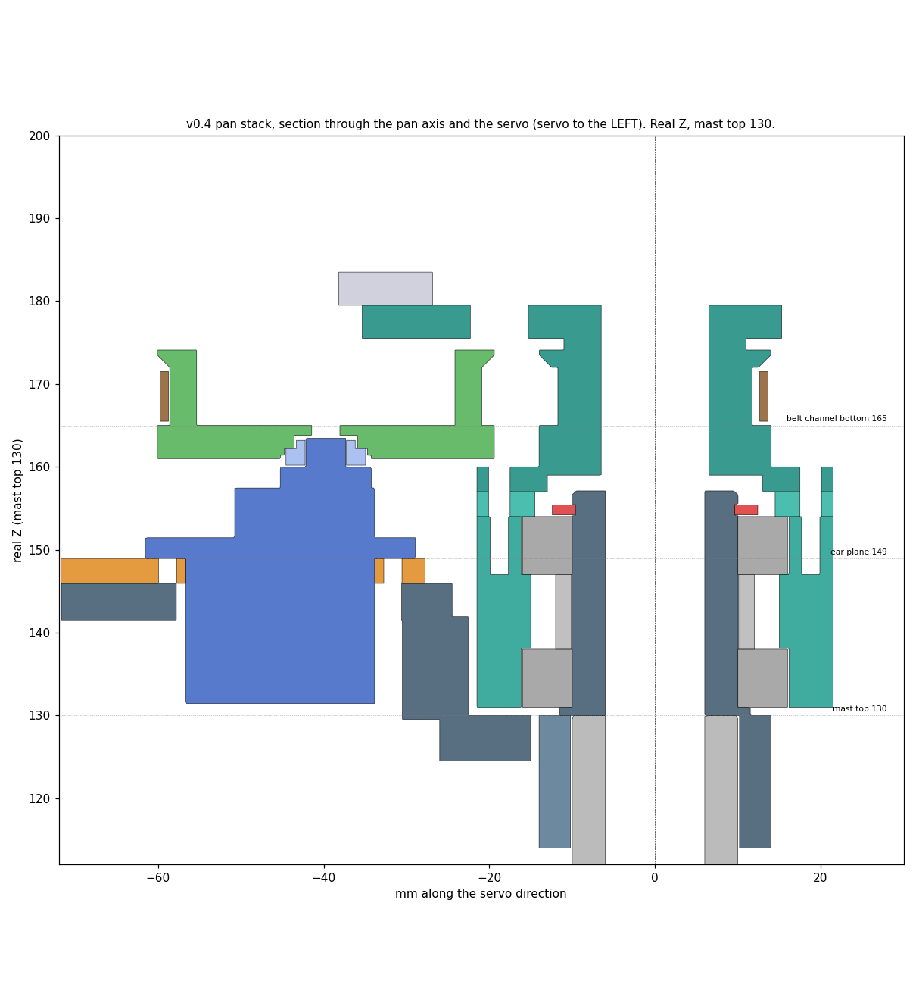
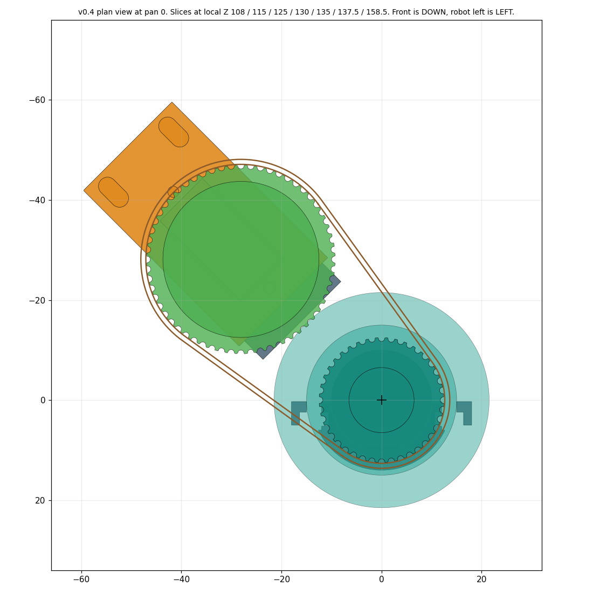
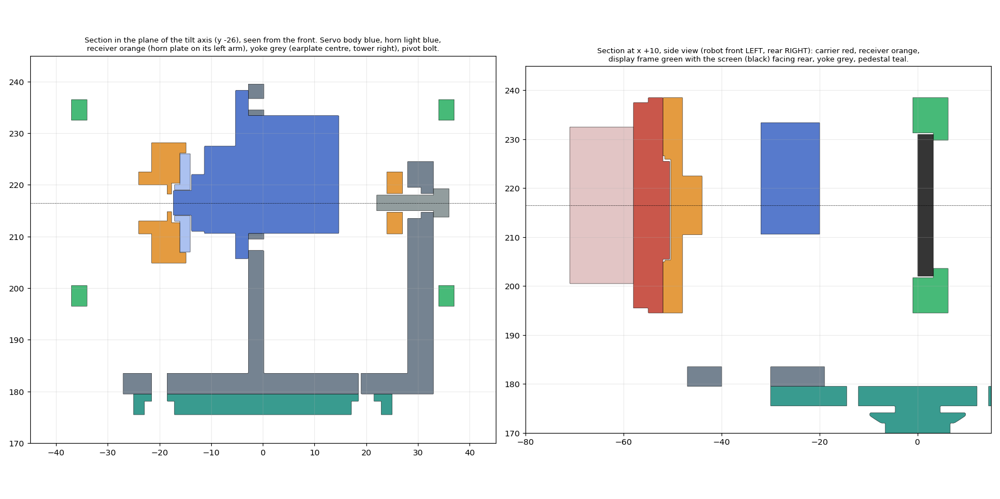

# Gladiator head v0.4 — the whole head, built 2026-10-01

**Status: design candidate, not released.**
- **Stage 1** is the pan stack: everything between the mast and the tilt yoke.
- **Stage 2** is the tilt side: yoke, GH44 receiver, dual carrier and rear display frame,
  regenerated from code. It was inherited from v0.3 until stage 2.
- **Not designed yet:** how the ToF and radar boards fasten to the carrier, and the cable harness.

Supersedes v0.3, which stays on hold (`../v03-belt/`). Source: `scripts/build_head_v04.py`, which
reads the **current** master (mast top Z130) and never writes it. The folder name `v04-pan-stack`
predates stage 2.

## Stage 2, the tilt side

| Part | What changed from v0.3 |
| --- | --- |
| **Tilt_Yoke** | servo window moved for the real shaft (5.9 from the near end, long end up); ears against the earplate at x -2.8 with **M2 pilots**; tilt pivot is now an **M3 bolt with a captive 6.0 nut** inside the tower (v0.3 wanted a 4 / 3 mm bushing, which isn't in the parts bin); 3.6 holes to the pedestal |
| **GH44_Tilt_Receiver** | the **tested register** unchanged; 3.6 M3 holes; **6.0 nut pockets** (the 5.7 ones took no nut); the tilt drive is the **same horn-plate pocket** as the pan pulley, with a 7 mm access hole through the left arm so the horn screw is reachable **along the tilt axis at any tilt**; pivot hole 3.6 |
| **GH44_Dual_Carrier** | the tested male register; 3.6 M3 holes (the 3.4 ones would not pass a screw); 2.6 display holes; v0.1's generic sensor slots dropped because they ran straight through the M3 holes. **Sensor mounting is not designed**, because the ToF and radar hole positions are not measured |
| **Rear_Display_Frame** | built for the real ST7789: pocket 62.5 x 29 (+0.3), **window 51.2 x 25.6 at 6.2 from the pin edge and 1.5 from the top** (+0.3 margin), 3 mm lip with 4 M2 pilots at the confirmed 58.25 x 26.00 pattern, back left open so the header passes. Pin edge at +X, the viewer's left from behind the robot; firmware can rotate the picture |

The hole pattern is confirmed, but **its offset to the board edges is assumed symmetric**. That agrees
with Jim's raw readings to about 0.3. The window has 0.3 of margin per side.

## What v0.3 got wrong, and what v0.4 does

| v0.3 | v0.4 |
| --- | --- |
| 40T on the servo, 60T on the head: head turned **less** than the servo | **60T on the servo, 40T on the head**: 1.5x, so 200 deg of head is 133 deg of servo (measured sweep 160) |
| centre distance 39.745 (a belt of 180.5) | theory **39.486**; the servo rides on a **sliding carriage**, 37.0 to 40.4, nominal 39.75 (Jim: tightest about mid-slot) |
| servo modelled 1-2 mm short; horn 1.5 too high | measured heights: spline top 32, case boss 28.5, ear underside 17.5; shaft 5.9 from the near end |
| servo fixed to the arm: no way to fit a closed 180 mm belt over the flanges | carriage slides in; slack end at 37.0 |
| drive pulley a 9 mm round "horn" | **horn plate** in the pulley: a pocket for the real cross horn (36 / 19, arms 6.8-4.8 and 3.8, hub 7.1) |
| all fastener holes at nominal | 3.6 M3, 2.6 M2 clearance, **6.0 AF captive nuts** (H5), M2 pilots 2.2 (pending H4b) |
| bearing seat 32.10, post 19.95 | seat **32.35** (plate F #2); post a **placeholder 20.05** until H3b |
| collar key 6 wide, 9.3 | the tested **1-notch key**: 7.2 wide, 0.10 from the flat |
| built for a Z120 mast and the old rails | re-based on the printed v2 mast (Z130) and the current master |
| rotor / pedestal r20.5, screw circle r18.3 | **r21.5 / r18.8**: the 2.2 M2 pilots left only 0.95 of wall |
| M2 screws not reachable from above | access holes in the top plate over each screw |

## The stack (real Z, mast top 130)

| Feature | Z |
| --- | ---: |
| pedestal base plate top | 160.0 |
| **drive pulley plate rim** (1.0 over the base plate) | 161.0 |
| belt channel, bottom to top (7.0, belt 6.0 centred) | **165.0 to 172.0** |
| servo ear plane / carriage top | 148.95 |
| servo body bottom | 131.45 |
| servo pad | 141.45 to 145.95 |
| pedestal top plate | 175.5 to 179.5 |
| tilt axis | 216.5 |

The belt line is set by the **pedestal**, which is fixed. The servo side adapts: its height is
worked out from the horn, so a wrong horn assumption moves the pad, not the pedestal.

## Checks run (all on solids, against the current master)

| Check | Result |
| --- | --- |
| head part pairs, every 5 deg of pan, tilt -25/0/25 | **13,432 tests, 0 collisions** |
| head parts against 19 current robot solids | **56,088 tests, 0 collisions** |
| servo side at both ends of the carriage travel | **8,360 tests, 0 collisions** |
| ToF 60 x 60 deg frustum over the whole pan range | **0 intersections** |
| 11.9 mm cable passage, mast to yoke | **0 mm3** |
| every part a single valid solid; master unchanged | yes; yes (SHA-256) |

The checker can fail. Its first run found 154 collisions: a servo model I had mirrored (long end
pointing into the arm and rotor) and a circlip envelope that cut 9 mm3 into its groove. Both were
my modelling errors, fixed and rechecked.

**Clearances:** drive pulley to pedestal base plate **1.0**; to the yoke **5.4**; to the retainer 4.0;
servo body to the neck **0.4**; neck arm to rotor 1.0; spline top to the plate roof **0.35**.

**Can you reach it?** Zero overlap does not mean assemblable, so the driver paths were checked:

| Screw | Reachable with the pulley fitted |
| --- | --- |
| 4 x M2 retainer screws (driver from above) | all four at pan **25-65 and 115-155** deg |
| horn screw (to take the pulley off) | pan **60 to 180** deg |
| 2 x M3 belt-tension clamp screws | every pan angle **except -20 to 0** |
| **all three** | **pan 60**, and **120-150** |
| tilt horn screw (driver along the tilt axis, from the left) | at **every** tilt, through the receiver's access hole |
| 2 x M3 yoke-to-pedestal bolts (from above) | **no**: under the receiver and the tilt servo. **Bolt the yoke down first** |
| 4 x M3 carrier-to-receiver screws (from the front) | **no**: behind the sensors. **Fit the carrier before the sensors** |

The clamp screws sit on a tab **outboard** of the pulley because the first layout put them under
its flange. Pan the head to 60 degrees to service the drive. The last two rows set the assembly
order, they are not faults.

## Parts, print orientation, and what each waits on

None of these is released. **Plate 1 needs no coupon result.**

| Part | cm3 | Print | Waits on |
| --- | ---: | --- | --- |
| **Pan_Raised_Pedestal** | 16.6 | base plate down, **support under the top plate only**, none in the belt channel | nothing |
| **Pan_Retainer** | 2.3 | flat | nothing |
| **Neck_Clamp_Cap** | 2.5 | axis vertical, lugs down | nothing (tested geometry) |
| Pan_Rotor | 15.4 | axis vertical, lower seat on the bed (relieved) | **H4b** (M2 pilot size) |
| Pan_Servo_Carriage | 2.3 | flat | **H4b** (ear pilots) |
| Neck_Main | 17.7 | axis vertical, collar down; supports under the arm, riser and pad; **brim**: the bed contact is only 142 mm2 | **H3b** (post) and the horn arm thickness |
| Pan_Drive_Pulley | 7.9 | axis vertical, horn plate on the bed (pocket faces the bed, relieved), no support | **H6** (pocket clearance, arm thickness) |
| Tilt_Yoke | 12.1 | floor down, no support | **H4b** (servo ear pilots) |
| GH44_Tilt_Receiver | 11.8 | GH44 face down (register on the bed, relieved), arms up, no support | **H6** (horn pocket) |
| GH44_Dual_Carrier | 13.8 | sensor plate down, key up, no support | the sensor mounting, which isn't designed |
| Rear_Display_Frame | 14.7 | bezel face down; support under the four tabs only | **H4b** (M2 pilots) |

`plates/Gladiator_Head_v04_PLATE1_Pedestal-Retainer-Cap.3mf`: 21.4 cm3, about 27 g, three parts.

## Assembly order (argued, not yet done)

1. Neck collar onto the mast: rear half with the key into the flat, cap from the front, two M3 and the
   captive nuts. 2. Press the lower bearing into the rotor **from below**; lower the rotor onto the
   spindle. 3. Drop the spacer, then the upper bearing, then the circlip. 4. Retainer, then the
   pedestal, then 4 x M2 down through both into the rotor. 5. Slide the carriage in, fit the servo (4
   x ear screws, M2, into the pilots), horn on the spline. 6. Loop the belt over the 40T, put the 60T
   pulley on the horn with the belt on it, the carriage at its **slack** end (37.0); one horn screw
   through the plate clamps the plate to the horn. 7. Slide the carriage out until the belt is snug and
   tighten both M3 clamp screws.
8. **Yoke onto the pedestal** with 2 x M3 into the captive nuts under the seat: **before** the tilt
   servo and receiver, which cover those bolts. 9. Tilt servo into the earplate window from the left,
   ears against the plate, 2 x M2 into the pilots. Centre the servo electrically first. 10. M3 nut into
   the tower's inner pocket. Seat the cross horn in the receiver's pocket, offer the receiver onto the
   spline, and line up the right arm. Then the M3 pivot bolt from outside the tower, and the horn screw
   down the access hole along the tilt axis. 11. Carrier onto the receiver (register + 4 x M3 into the
   nut pockets), **before** the sensors. 12. Screen into the display frame (4 x M2 from behind into
   the lip), then the frame onto the carrier (4 x M2 through the carrier into the tabs).

## ASSUMED or PENDING — read before trusting any of it

| What | State |
| --- | --- |
| spindle post **20.05** | placeholder. 20.20 jammed a bearing. Set by **H3b** |
| M2 pilot **2.2** | the best of the first three; Jim said maybe bigger. **H4b** |
| horn pocket clearance **0.15** | **H6** |
| horn **arm thickness 2.0** | **ASSUMED, not measured.** Sets the servo height, so the belt alignment |
| gap between case boss and horn **0.25** | **ASSUMED** |
| servo shaft position, 5.9 | +-0.6; the carriage slot covers it |
| shaft centred across the 12 mm width | assumed, standard SG90 |
| horn screw head about 4 mm | read off a photo. The 3.4 centre hole depends on it |
| belt can be fitted at the slack end | argued, not tested |
| no stiffness, load or creep rating | none claimed |

The first assembly should leave room to shim the servo height: if the belt rides half off a
groove, the horn arm thickness was wrong.

| display hole offset to the board edges | ASSUMED symmetric (the pattern itself is confirmed) |
| tilt pivot: M3 bolt turning in a 3.6 hole in PLA | fine for a prototype; it will wear |

## Still not designed

- **Sensor mounting on the carrier.** The SEN0628 and C4001 hole positions are not measured. The
  envelopes are v0.3 placeholders.
- **The cable harness**: about 14 conductors down a 12 mm bore through 200 degrees of pan.
- The yoke's retainer-screw access cut turned out unnecessary: the screws are reachable past the yoke.

The master's imported `HeadCandidate_v01` is **still the old v0.1** and was not touched.

## Files

`Gladiator_Head_v04_PanStack.FCStd` / `.step` (head parts at real position, plus the robot
from the master as context), `validation.json`, `head-config.json`, `stl/` (11 parts),
`plates/`, `preview-*.png`.
